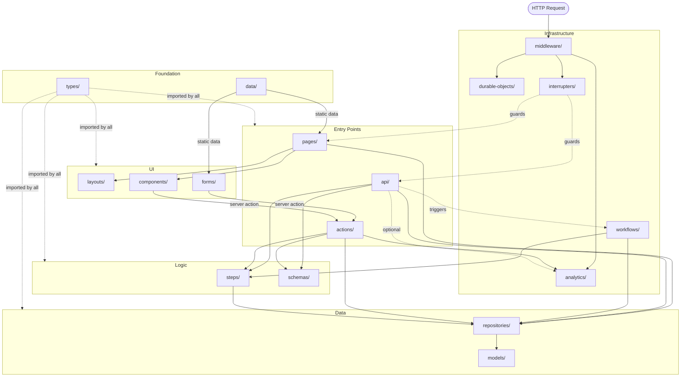

# Project Architecture

This document describes how the application is structured — what each `src/` directory is for, where each type fits in the request lifecycle, and how types relate to each other.

## Request lifecycle

**Browser navigation and API calls** flow through the full server stack:

```
HTTP Request
  └── Middleware (global, every request — enriches ctx)
        └── Route matching
              └── Interruptors (per-route guards — return or throw)
                    └── Page / API handler
                          ├── Steps (shared pipeline logic)
                          └── Repositories (data access)
```

**Form mutations** are invoked as server actions from client components:

```
Client component
  └── Server action (Actions — validate, orchestrate, return ActionState)
        ├── Schemas (validate input)
        ├── Steps (shared pipeline logic)
        └── Repositories (data access)
```

**Background workflows** are triggered by API calls and run outside the request cycle via Cloudflare Workflows:

```
API handler
  └── env.MY_WORKFLOW.create(params)   ← returns instance ID; handler returns immediately
        └── WorkflowEntrypoint.run()   ← executes on CF infrastructure, not in the request
              ├── step.do(...)          ← each step is independently retried on failure
              └── Repositories (data access — same db module, same env injection)
```

Workflow step logic is implemented as standalone exported async functions, keeping it unit-testable independently of the Workflow runtime. See `src/workflows/readme.md` for conventions.

## Import/usage diagram



## Type map

| Directory | Type | Role |
|---|---|---|
| `src/middleware/` | Middleware | Global request enrichment and guards; runs before route matching |
| `src/interrupters/` | Interruptors | Per-route guards; `return` a Response to halt with a known response, `throw` to surface to the nearest `except` handler |
| `src/pages/` | Pages | Route handlers for browser navigation; async RSCs that fetch from repositories |
| `src/api/` | API handlers | Route handlers for HTTP endpoints; return `Response.json()` |
| `src/actions/` | Actions | Server functions for form mutations; return `ActionState<T>` |
| `src/steps/` | Steps | Shared pipeline logic called by actions and API handlers; throw `RzStepError` |
| `src/repositories/` | Repositories | Data access layer; the only place that imports `db` and `@/models` |
| `src/schemas/` | Schemas | Zod input validation; called by actions and API handlers before repository access |
| `src/forms/` | Forms | Client-side form components; call server actions on submit |
| `src/components/` | Components | Reusable React components; receive data as props |
| `src/layouts/` | Layouts | Page-level wrapper components providing consistent navigation chrome |
| `src/types/` | Types | All shared TypeScript types; barrel-exported from `index.ts` |
| `src/models/` | Models | Drizzle table schemas and relations; source of truth for migrations |
| `src/durable-objects/` | Durable Objects | Cloudflare Durable Object classes (currently: session management) |
| `src/workflows/` | Workflows | Cloudflare Workflow classes for durable background processing; triggered via API, each step independently retried |
| `src/analytics/` | Analytics | Fire-and-forget CF Analytics Engine helpers; called by middleware and actions to record discrete events |
| `src/data/` | Static data | Reference data used by forms and pages (countries, months, permissions) |

## Internal utilities

Utilities live close to their consumers — there is no shared `src/utils/` directory:

- `src/api/utils.ts` — API handler utilities (`rzStepErrorToJsonResponse`)
- `src/repositories/utils.ts` — repository utilities (`validateUuid`)
- `src/schemas/utils.ts` — schema utilities (`requiredUuid`, `optionalString`, etc.)

## Key rules

- **Repositories are the only DB gateway** — nothing outside `src/repositories/` imports from `@/db` or `@/models`
- **Types are centralised** — all shared types live in `src/types/`, barrel-exported, imported as `@/types`
- **Pages call repositories directly** — not steps or actions
- **Actions and API handlers call repositories or steps** — not each other
- **Steps are for shared logic only** — if only one caller uses it, it doesn't need to be a step
- **Return vs throw is the same in middleware and interrupters** — `return Response` sends that response directly; `throw` routes to the nearest `except` handler via rwsdk's error chain. rwsdk walks backwards through the flat compiled route list to find the handler — page routes reach `RootErrorHandler` (HTML), API routes reach `apiErrorResponse` (JSON). The only real distinction between middleware and interrupters is global vs per-route scope.
- **Utilities live near their consumers** — no shared utils grab-bag

## Each type in detail

Each `src/` directory has its own `readme.md` with structure, patterns, and guidelines for that type. Read the relevant README before working in a given area.
